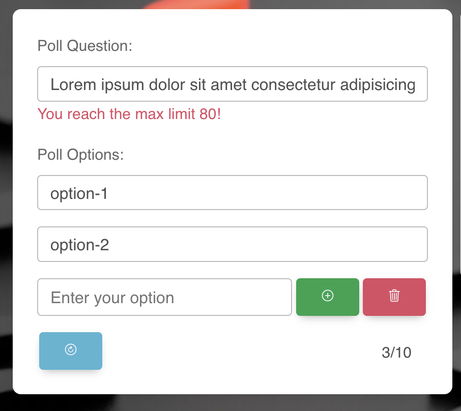

# simple-poll

- Simple poll app is front end single page application which is divided in three sections.
- It has HomePage view component and there are three components sections rendering inside main HTML tag.

  - On the first section: user can create a poll up to 10 options and it called PollForm component.
  - On the central section : user can see PollVote component and he can vote by selecting one of the options and pressing the "vote" button.
  - On the right section: user can see PollChart component and it is Bar chart will updated based on the
    questions created and the votes that each question got.

    

## Project setup

```npm
npm install
```

### Compiles and hot-reloads for development

```npm
npm run serve
```

### Compiles and minifies for production

```npm
npm run build
```

### Run your functional tests

```npm
npm run ft
```

### Lints and fixes files

```npm
npm run lint
```

## Navigator

- [**User experience UX**](#user-experience-ux)
  - [Use cases](#use-cases)
  - [Site structure](#site-structure)
  - [Design choices](#design-choices)
    - [Typography](#typography)
    - [Color scheme](#color-scheme)
- [**Features**](#features)
  - [Existing features](#existing-features)
    - [Poll Form Component](#poll-form-component)
    - [Poll Vote Component](#poll-vote-component)
    - [Poll Chart Component](#poll-chart-component)
  - [Future features](#future-features)
- [**Technologies used**](#technologies-used)
- [**Testing**](#testing)
  - [Code Validation](#code-validation)
  - [Responsiveness Test](#responsiveness-test)
  - [Browser Compatibility](#browser-compatibility)
  - [Lighthouse](#lighthouse)
  - [Automation testing](#automation-testing)
  - [User stories testing](#user-stories-testing)
- [**Deployment**](#deployment)
  - [To fork the repository on GitHub](#to-fork-the-repository-on-github)
  - [To create a local clone of this project](#to-create-a-local-clone-of-this-project)

## User experience (UX)

### Use cases

- As the owner, I want to change my poll question.
- As the owner, I want to add, edit or remove the options of my poll.
- As the owner, I want to reset the whole form, including answers.
- As the user, I want to see the UI refresh automatically when something changes.
- As the respondent, I want to send several answers.
- As the respondent, I want to see the changes in real time.

[Back to top](#navigator)

## Site structure

- One page application
- App component
- HomePage view: main component rendering inside it 3 other vue components.
- Components interact with each others using central application pinia state store.
- Application using pinia store for state management.

[Back to top](#navigator)

## Design choices

### Typography

- The fonts chosen were 'Helvetica' for the body text. It fall back to sans-serif respectively.
- 'Helvetica' is used for the body text as it provides a nice contrast to the site, and it easy to read.

### Color scheme

- Use the color group to get the [contrast-grid](https://contrast-grid.eightshapes.com/).
- There are chart bars 10 colors scheme 
- Bootstrap buttons background colors used are: bg-success, bg-danger, bg-info

[Back to top](#navigator)

# Features

## Existing features

### Poll Form Component

- It shows owner a form allow him to create a simple question poll with options.
- Question label.
- Question input with "Enter your question" placeholder with max 80 character input.
- Show error span text in case question input reach 80 characters.
- Options label.
- All inputs has max length 80 characters.
- Show error span text for each option in separately in case input text length reach 80 characters.
- There are two default options "option-1" and "option-2"
- There are minimum two options always.
- Default options able to edit but.
- First two options input owner can edit but not delete.
- There is add button next to the second option input creates new option input field with add and delete buttons next to it.
- Owner can add options to reach max of 10 options input fields the .
- Owner can see counter below options loop to keep updated with current number of options.
- When Owner reach 10 options the add button disabled.
- Also there is _Reset_ button to reset form value to default.
- All data and states interact with piniaStore dynamically on real time.
- All changes are realtime updating and rendering in _PollVote_ Component.

Default home page:


Edit PollForm component with two options:

- As you see that also other components get updated directly with the changes.


Form max options of 10 disable add button:


Delete option in the middle of options list


After click reset button:


Question Input validation:



Options Input validation:


[Back to top](#navigator)

### Poll Vote Component

- As user I can see the Poll form component changes automatically rendering in Poll Vote component using pinia state store.
- Users can choose one of the option he sees on Poll Vote component then click on Vote button.
- Users can vote as many as they want.

  

[Back to top](#navigator)

### Poll Chart Component

- It is vue 3 wrapper third party component using Chart.js library called vue-chartjs npm package for vue chart.
- Bar Chart component watching data changes and get updated automatically with users and owner input data
- PollChart component uses pinia store to interact and keep updated with options list and users votes.

  

[Back to top](#navigator)

## Future features

[Back to top](#navigator)

# Technologies used

- [HTML5](https://html.spec.whatwg.org/) - provides the content and structure for the website.
- [SCSS](https://sass-lang.com/) - provides the styling.
- [Bootstrap 5](https://getbootstrap.com/) - for responsiveness and grid
- [Material Design for Bootstrap v5](https://mdbootstrap.com/)
- [JavaScript](https://developer.mozilla.org/en-US/docs/Web/JavaScript) - provides functions to show users the clients list and make them able to click on the clients and show him client details popup and he can go back to main clients list page.
- [VueJS 3](https://vuejs.org/) - Javascript frontend frame work used to build the app.
- [Test Cafe](https://testcafe.io/) - Functional testing for Automation testing and E2E testing.
- [Jest](https://jestjs.io/) - Unit testing used to test javaScript and vue components and pinia store.
- [@vue/test-utils](https://test-utils.vuejs.org/guide/) - Vue Test Utils is framework agnostic - you can use it with whichever test runner you like. The easiest way to try it out is using Jest, a popular test runner.
- [Pinia Store](https://pinia.vuejs.org/) - Pinia is a store containing vue app states and api hooks. We are using it for better state management.
- [@pinia/testing](https://pinia.vuejs.org/cookbook/testing.html#unit-testing-a-store) - Testing package allow us to createTestingPinia
- [Vue-Cli](https://cli.vuejs.org/) - used to generate vue js app.
- [Visual Studio Code](https://code.visualstudio.com/) - used as code editor.
- [Github](https://github.com/) - used to host and edit the website.

[Back to top](#navigator)

# Testing

## Code Validation

### HTML

- No errors were returned when passing through the official [W3C validator](https://validator.w3.org/)

### SCSS

- No errors were found when passing through the official [W3C validator](https://jigsaw.w3.org/css-validator/)

[Back to top](#navigator)

## Responsiveness Test

- The responsive tests were exercised by using [Google Chrome DevTools](https://developer.chrome.com/docs/devtools/).

|        | iPad mine | Galaxy S5 | iPhone 6/7/8 | iPad | iPad Pro | iPhone 6/7/8 plus | Display >950px |
| ------ | --------- | --------- | ------------ | ---- | -------- | ----------------- | -------------- |
| Text   | pass      | pass      | pass         | pass | pass     | pass              | pass           |
| Images | pass      | pass      | pass         | pass | pass     | pass              | pass           |

[Back to top](#navigator)

## Browser Compatibility

- The Show Simple Poll site was tested on the following browsers Google Chrome, Safari and Mozilla Firefox.
- Appearance, functionality and responsiveness were consistent on a range of different device sizes and browsers.

[Back to top](#navigator)

## Lighthouse

The Show Simple Poll site was also tested using [Google Lighthouse](https://developers.google.com/web/tools/lighthouse) in Chrome Developer Tools to test the page for:

- Performance - How the page performs whilst loading.
- Accessibility - Is the site accessible for all users and how can it be improved.
- Best Practices - Site conforms to industry best practices.
- SEO - Search engine optimization. Is the site optimized for search engine result rankings.


[Back to top](#navigator)

## Automation testing

[Back to top](#navigator)

## User stories testing

[Back to top](#navigator)

## Deployment

### To fork the repository on GitHub

A copy of the GitHub Repository can be made by forking the GitHub account. This copy can be viewed and changes can be made to the copy without affecting the original repository. Take the following steps to fork the repository;

1. Log in to **GitHub** and locate the [repository](https://github.com/OmarNizam/simple-poll).
2. On the right-hand side of the page inline with the repository name, is a button called **'Fork'**. Click on the button to create a copy of the original repository in your GitHub Account.

[Back to top](#navigator)

## To create a local clone of this project

The method for cloning a project from GitHub is below:

1. Under the repository’s name, click on the **code** tab.
2. In the **Clone with HTTPS** section, click on the clipboard icon to copy the given URL.
3. In your IDE of choice, open **Git Bash**.
4. Change the current working directory to where you want the cloned directory to be made.
5. Type **git clone**, then paste the URL copied from GitHub.
6. Press **enter**, and the local clone will be created.

[Back to top](#navigator)
